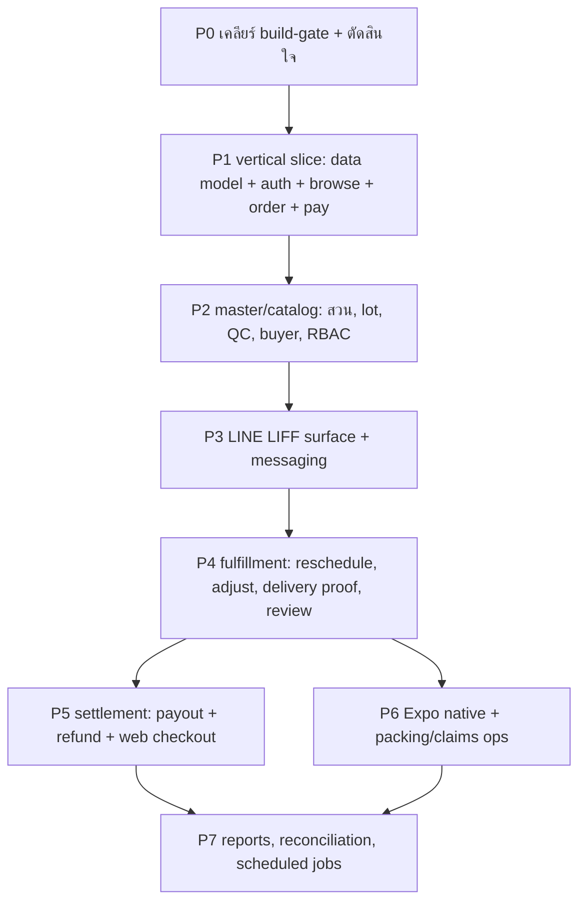

# Roadmap ปรับ Blueprint — SCG Togo สู่ Thai Agri Market

> **ประเภท:** Roadmap จาก code-architect (เอกสารเท่านั้น) ไฟล์นี้ไม่แก้ code, schema หรือ migration ใดๆ
> **วันที่:** 2026-06-26
> **Stakes:** Durable production build (ทุก phase ถัดไปเป็นระดับ production)
> **ข้อกำหนดที่เจ้าของอนุมัติแล้ว:** Stack = Next.js + Prisma + Postgres. Customer surface v1 = LINE LIFF + web checkout + Expo native mobile
> **ภาษาหลัก:** ไทย (ชื่อ technical คงเป็นอังกฤษใน backtick)

---

## 1. สรุปผู้บริหาร

Blueprint ที่ `/Users/thikhampornosiri/Downloads/blueprint/` คือเอกสารของ **SCG Togo / CPAC ToGo** ซึ่งเป็น marketplace ขายคอนกรีตผสมเสร็จ (RMC) ที่ขึ้น production แล้ว ลูกค้าสั่งผ่าน LINE (PHP LIFF app) ระบบหาโรงงานคอนกรีตที่ใกล้และผ่านเงื่อนไขที่สุด คิดราคาจาก pricelist ตามจังหวัด/วันที่/ระยะทาง/ประเภทรถ รับเงินผ่าน 2c2p แจ้งโรงงานผ่าน LINE Messaging API ประสานการส่งพร้อมรูปยืนยัน แล้ว **จ่าย payout** ให้โรงงานหรือบริษัทแม่ CPAC หลังหักค่าธรรมเนียม 2% + VAT เป็นระบบ 4 ส่วน (`scg-togo-api` Go REST, `scg-togo-reactjs` admin, `scg-togo-lineliff` PHP LIFF, `scg-togo-linebot` Go push/webhook) หลังบ้านเป็น MySQL 65 ตาราง (`02-data-model/tables.md`)

**ทำไมถึง map กับ Thai Agri Market ได้.** Thai Agri Market ก็เป็น managed marketplace ที่ platform ไม่ถือ stock เอง: operator คัดสวน (= company/plant) เปิด lot ตาม harvest window (= product) รับเงิน แล้วจ่ายส่วนที่เหลือให้สวนหลังหักค่าธรรมเนียม แกนเงิน (order -> escrow/hold -> payout -> refund), โมเดล running-number กันชนกัน, order lifecycle, flow reschedule/adjust, loop รูปส่ง + review, RBAC admin, และ integration LINE LIFF + Messaging นำมาใช้ซ้ำได้ตรงๆ ทั้งหมด ความต่างเชิงโครงสร้างคือ **โมเดล logistics**: SCG Togo จับคู่โรงงานตามระยะทาง (geofence/30 กม. + ระยะถนนจาก Longdo) ส่วน Thai Agri Market เป็นผลไม้จากต่างจังหวัดส่งโดย logistics partner เข้ากรุงเทพและปริมณฑล ดังนั้น distance band, การแบ่งคิวรถ, และ attribute คอนกรีต slump/strength/structure **ตัดทิ้งทั้งหมด**

**คำแนะนำหลัก.** ใช้ blueprint เป็น **เอกสารอ้างอิงเชิงพฤติกรรมและ data model ไม่ใช่ผู้บริจาค code** สร้างใหม่บน Next.js + Prisma + Postgres เก็บ pattern เงิน/concurrency/notification/RBAC ที่พิสูจน์แล้ว ตัดทุกอย่างที่เป็น physics คอนกรีต แล้วลำดับการสร้างเป็น vertical slice บางๆ ก่อน (Phase 1) ก่อนค่อยซ้อน fulfillment, settlement, และ customer surface 3 ตัว สร้าง surface ลูกค้า **ทีละตัว** (LIFF ก่อน, web checkout สอง, Expo native สุดท้าย) ไม่ทำพร้อมกัน

**ข้อควรระวัง build-gate (เจ้าของตัดสิน อย่าถือว่า override).** `README.md` และ vault `operator-master-plan.md` (Gate 4) ระบุว่า software build ถูก **block** จนกว่า: (1) ทำ paid drop เทียบกันได้ 3 ครั้ง, (2) เห็น paid repeat behavior, (3) contribution ระดับ lane เป็นบวกหลังหัก variable cost, (4) cash reconciliation ปิดได้, (5) วัด manual pain ที่ซ้ำๆ ได้ มี Gate 0 blocker เพิ่ม: ยังไม่มี marketplace classification ที่ผ่าน counsel, ไม่มี money flow ที่ PSP อนุมัติ, ไม่มี invoice/accounting map ที่ accountant อนุมัติ, ไม่มี logistics SLA + evidence field, ไม่มีการซ้อม pack/QC เฉพาะผลไม้ **roadmap นี้คือแผนที่พร้อม build แต่จะ activate ก็ต่อเมื่อเจ้าของเคลียร์ build gate แล้วเท่านั้น** การถือว่า phase ใดที่เขียน code payout/refund ได้รับอนุญาตแล้ว เป็นการตัดสินใจของเจ้าของโดยชัดแจ้ง (ดูหัวข้อ 10)

---

## 2. Mapping สถาปัตยกรรม component

4 deployable ของ blueprint ยุบเหลือ Next.js monorepo เดียว (`apps/web`) + Expo app (`apps/mobile`) + worker webhook/push ภายในตัวเดียว "deferred engineering notes" ใน README (ข้อ 1-4) และ vault `stack.md` map ลงตรงรอยต่อแต่ละจุด

| Component (blueprint) | Stack | เป้าหมายใน Thai Agri Market | หมายเหตุ / บทเรียน deferred ใช้ตรงไหน |
|---|---|---|---|
| `scg-togo-api` (Go REST, port 8005) | Go 1.23 / gorilla-mux / MySQL | **Next.js route handlers** ใต้ `apps/web/app/api/**` (App Router), data layer ผ่าน Prisma, server action สำหรับ mutation | Note 1 (payment ใน DB tx): ทุกการเปลี่ยน state เงินครอบด้วย `prisma.$transaction` Note 3 (HMAC webhook verify): handler callback PSP verify signature ก่อนเขียน DB |
| `scg-togo-reactjs` (React 16 admin) | React/Redux-Saga/AntD/Firebase | **Admin dashboard** = route group `apps/web/app/(admin)/**`, server component + RSC data fetch, gate ด้วย RBAC | Firebase admin auth เปลี่ยนเป็น provider ที่เลือก (หัวข้อ 6) permission catalog ขับการ render เมนู |
| `scg-togo-lineliff` (PHP LIFF) | PHP MVC | **LIFF web app** = route group `apps/web/app/(liff)/**`, client component เรียก LIFF SDK | Note 2 (verify LINE token ฝั่ง server): client LIFF ไม่ self-assert `line_id` แต่ route ฝั่ง server verify LINE ID token แล้ว derive identity แทน scheme `MD5(line_id)` AES ของ blueprint |
| `scg-togo-linebot` (Go push + webhook) | Go / line-bot-sdk / state ใน memory | **Internal linebot service** = module/route บางๆ (`apps/web/app/api/internal/push/**`) + webhook handler (`apps/web/app/api/line/webhook`) | Note 4 (decouple linebot): code แอปไม่ call LINE ตรง แต่ POST ไป internal `/push/*` push แบบ fire-and-forget ของ blueprint (`09` bug #5) เปลี่ยนเป็น sender ที่มี retry/queue (หัวข้อ 11) state machine ถ้าเก็บไว้ ย้ายออกจาก in-memory singleton (`09` bug #6) |
| Web checkout (ใหม่ ไม่มีใน blueprint) | — | **Web checkout** = route group `apps/web/app/(shop)/**` | surface ที่ SCG Togo ไม่มี (มันเป็น LINE-only) ใช้ route handler order/payment เดียวกับ LIFF |
| Expo native (ใหม่ ไม่มีใน blueprint) | — | `apps/mobile` (Expo ~56, RN 0.85) | กิน JSON API เดียวกัน ลำดับท้ายสุด (Phase 6+) ไม่มีคู่ใน blueprint |

**การตัดสินใจเชิงสถาปัตยกรรมที่ inherit จาก blueprint:**
- **API เดียวรับหลาย surface** — blueprint แยก `/api/...` (admin) vs `/api/liff/...` (customer) vs interface callback เก็บการแยกนี้: `app/api/admin/**`, `app/api/liff/**`, `app/api/interface/**` (callback PSP/logistics), `app/api/shop/**` (web checkout) LIFF กับ shop ใช้ logic order/payment ร่วมกัน
- **Surface webhook/callback ไม่ auth ด้วย JWT แต่ verify ด้วย signature** — callback PSP (HMAC), webhook LINE (LINE signature) เป็นรอยต่อเสี่ยงสุด แยกออกมาให้ชัด

---

## 3. Mapping data model

Blueprint มี **65 ตาราง** (`02-data-model/tables.md`) + 1 ตารางหลัง dump (`saleorder_increase_payments`) schema ปัจจุบันของ Thai Agri Market (`apps/web/prisma/schema.prisma`) มี **7 model**: `User`, `Orchard`, `Lot`, `Order`, `OrderItem`, `Payment` (มี `EscrowStatus`), `Review` ตารางด้านล่างจัด 65 ตามกลุ่ม domain แล้วระบุ keep / adapt / drop

### 3.1 7 model ที่มี -> ทิศทางเป้าหมาย

| Model ที่มี | คู่ใน blueprint | ทิศทาง |
|---|---|---|
| `User` (BUYER/SELLER/ADMIN) | `m_customers` + `m_users` + `verified_line_id` | **Adapt + แยก** buyer (LINE/verified) ต่างจาก admin staff (RBAC) แนะนำเก็บ `User` ไว้สำหรับ buyer, เพิ่ม `AdminUser` + ตาราง RBAC แยก, และตาราง `VerifiedLineId` / consent |
| `Orchard` | `m_companies` + `m_plants` | **Adapt** คอนกรีตแยก company (ผู้ขายตามกฎหมาย) จาก plant (จุดส่งของ) ผลไม้ยุบเป็น `Orchard` เดียว = ผู้ขาย + แหล่ง พร้อม `province`, `ownerId`, `isVerified`, และ relation บัญชี payout เพิ่ม `rating` aggregate |
| `Lot` | `m_products` + pricing | **Adapt** เพิ่ม field harvest-window, enum grade, unit (kg/ลัง), min order qty, state QC checkpoint ราคาเป็นต่อ-lot (ไม่มี pricelist matrix) |
| `Order` | `temp_saleorders` + `saleorders` | **Adapt** เพิ่ม running `orderNo`, status lifecycle (แบบผลไม้), expiry, column เงิน (fee/vat/transferAmount), การแยก `temp/confirmed` หรือ staging table |
| `OrderItem` | line detail ของ `saleorders` | **Keep** คอนกรีตเป็น 1 product ต่อ order แต่ผลไม้รองรับ cart หลาย lot จึงต้องการ `OrderItem` จริง |
| `Payment` (+ `EscrowStatus`) | column เงินใน `saleorders` + `payment_direct_logs` + `payout_transactions` + `saleorder_refunds` | **Adapt — money-critical** `Payment` เดี่ยวบางไป รองรับ payout/refund ไม่ได้ ต้องมีตาราง payout + refund + raw-callback-log (ดู 3.4) |
| `Review` | `company_reviews` | **Adapt** เพิ่ม `orchardId`, `orderId`, คำนวณ `Orchard.rating` ใหม่ตอน insert |

### 3.2 Identity / RBAC / auth (Blueprint Domain 4 + LINE/consent)

| ตาราง blueprint | ตัดสิน | เหตุผล | Model เป้าหมาย |
|---|---|---|---|
| `m_users` | adapt | admin staff | `AdminUser` |
| `m_usergroups`, `m_usergroup_has_user` | keep | จัดกลุ่ม role | `Role`, `UserRole` (หรือ M:N) |
| `m_permissions`, `m_usergroup_has_permissions` | keep | permission catalog ขับเมนู admin (`11-seed-data` บอกถ้าไม่มี admin จะไม่มีเมนู) | `Permission`, `RolePermission` |
| `m_usergroup_has_companies`, `m_user_has_plants` | adapt | data scoping -> scope ตาม orchard | `RoleOrchardScope` / `UserOrchardScope` |
| `blacklist_token` | adapt-or-drop | JWT revocation ขึ้นกับ admin auth provider ที่เลือก | `RevokedToken` (เฉพาะถ้า self-issue JWT) |
| `verified_line_id` | keep | gate การสั่ง (LINE user ที่ verify เบอร์แล้ว) | `VerifiedLineUser` |
| `customer_consents`, `customer_consent_logs` | adapt | PDPA consent; แทน OneTrust (หัวข้อ 6) | `Consent`, `ConsentLog` |
| `otp_logs` | keep | ออก OTP เบอร์ | `OtpLog` |
| `plant_register_code` | adapt | bind LINE staff สวน (แก้ varchar->FK, bug #10) | `OrchardRegisterCode` |

### 3.3 Master / catalog (Blueprint Domain 1)

| ตาราง blueprint | ตัดสิน | เหตุผล | เป้าหมาย |
|---|---|---|---|
| `m_companies` | adapt | -> entity เจ้าของ/ผู้ขายสวน (รวมเข้า Orchard หรือแยก OrchardOwner) | `Orchard` / `OrchardOwner` |
| `m_plants` | adapt | -> แหล่งสวน; **ตัด** geofence/รัศมี/lead-time-แบบระยะทาง | `Orchard` (province, lat/lng optional แค่โชว์) |
| `m_products` | adapt | -> `Lot` (ผลไม้ตามฤดู) | `Lot` |
| `m_product_types` | adapt | -> reference ชนิด/พันธุ์ผลไม้ | `FruitType` (optional) |
| `m_strengths`, `m_slumps`, `m_product_structures`, `m_product_has_structures` | **drop** | เฉพาะคอนกรีต (กำลังอัด, slump, dump rate เสา/พื้น) | — (ไม่มีคู่ผลไม้) |
| `m_pricelists`, `m_pricelist_effective_dates`, `m_pricelist_has_provinces`, `m_pricelist_items` | **drop (matrix); adapt (window)** | matrix ราคา จังหวัด x วัน x ระยะ x รถ ยุบเหลือราคาต่อ-lot + harvest window เก็บแค่แนวคิด effective-date เป็น harvest/sale window ของ lot | `Lot.price`, `Lot.harvestStart/End`, `Lot.saleWindowStart/End` |
| `m_delivery_distances` | **drop** | ไม่มี distance-band pricing; logistics partner เป็น flat/quote | — |
| `m_vehicle_types`, `m_vehicle_type_configs` | **drop** | ไม่มีการแบ่งคิวรถ; แทน `min_order_fee` ด้วย `Lot.minOrderQty` ถ้าจำเป็น | `Lot.minOrderQty` (optional) |
| `plant_has_products` | **drop** | junction (plant,pricelist,product,distance,truck) ไม่มีคู่ผลไม้; lot สังกัด 1 orchard | — |
| `m_operating_hours_templates` + detail + has_plants | **drop** | ตารางเปิด-ปิด/ห้ามรถของ plant; ความพร้อมผลไม้คือ harvest window | — |
| `m_provinces` | keep | dropdown จังหวัด + พื้นที่ supply/delivery | `Province` reference (seed) |
| `m_sections` | drop | จัดกลุ่ม company; ไม่ต้องที่ scale pilot | — |
| `m_banks` | keep | เลือกธนาคาร payout/refund | `Bank` reference (seed) |
| `m_faqs` | keep (defer) | เนื้อหา FAQ | `Faq` |
| `vat_certificate_files` | adapt (defer) | เอกสารภาษีสวน; เฉพาะถ้าต้องจด VAT | `OrchardTaxDoc` |

### 3.4 Orders + เงิน (Blueprint Domain 2 & 3) — MONEY-CRITICAL

| ตาราง blueprint | ตัดสิน | เหตุผล | เป้าหมาย |
|---|---|---|---|
| `temp_saleorders` | adapt | staging order, expire 1 ชม. -> reservation hold | `Order` ที่ `status=RESERVED` หรือ model `Reservation` |
| `saleorders` | adapt | hub ของ order + source-of-truth เงิน | `Order` (+ column เงิน) |
| `saleorder_running_no` | **keep** | เลข order กันชนกัน (`FOR UPDATE`, bug #2 = preserve) | `OrderRunningNo` |
| `customer_sitecode_logs` | drop | counter รหัสไซต์; ผลไม้ใช้ที่อยู่ส่งธรรมดา | — |
| `report_running_no` | adapt (defer) | เลขรายงาน; เลื่อนไป phase report | `ReportRunningNo` |
| `saleorder_reschedules` | adapt | เลื่อนวันส่ง (P/A/R) | `DeliveryReschedule` |
| `saleorder_adjustments` | adapt | ลด/เพิ่มจำนวน (P/A/R/C) | `OrderAdjustment` |
| `saleorder_increase_payments` | adapt | จ่ายเพิ่มตอนเพิ่มจำนวน | `IncreasePayment` |
| `saleorder_refunds` | **keep — money-critical** | txn refund (full/partial), payout_type Customer/Plant | `Refund` |
| `delivery_orders`, `delivery_order_has_images` | keep | proof ส่ง + รูป (SFTP -> object storage) | `Delivery`, `DeliveryImage` |
| `company_reviews` | adapt | rating ดาว -> `Review` + คำนวณ `Orchard.rating` ใหม่ | `Review` |
| `accounts`, `account_has_plants` | **adapt — money-critical** | บัญชีธนาคาร payout สวน | `PayoutAccount` (orchardId, accNo, accName, bankId, payoutKey) |
| `payout_transactions`, `payout_transaction_orders` | **keep — money-critical** | batch payout + link batch-to-orders | `PayoutBatch`, `PayoutBatchOrder` |
| `payout_responses`, `payout_error_logs` | keep | callback/error payout PSP (เพิ่ม FK, bug #11) | `PayoutResponse`, `PayoutErrorLog` |
| `payment_direct_logs` | **keep — money-critical** | audit raw callback payment PSP | `PaymentCallbackLog` |
| `m_payment_channels` | adapt | วิธีจ่าย + fee; channel ที่ PSP กำหนด | `PaymentChannel` |
| column payout บริษัทแม่ CPAC (`billing_cycle`, `togo_payout_to_cpac_*`) | **drop** | การแยก CPAC parent/franchise เฉพาะองค์กร SCG; ผลไม้มี payout path เดียว | — |

### 3.5 Logging / notification / job (Blueprint Domain 5)

| ตาราง blueprint | ตัดสิน | เหตุผล | เป้าหมาย |
|---|---|---|---|
| `noti_topic`, `noti_has_line` | adapt (defer) | list broadcast admin | `NotiTopic`, `NotiSubscriber` |
| `liff_request_logs` | adapt | audit request LIFF | `LiffRequestLog` |
| `line_bot_logs` | adapt | log interaction bot | `LineBotLog` |
| `cron_logs` | **keep** | dedup job ครั้งเดียวต่อ period (PK task+date) | `CronLog` |
| `schedule_report` | adapt (defer) | config schedule email-report | `ScheduleReport` |

**จุดเน้น money-critical:** `Payment`/`Refund`/`PayoutBatch`/`PayoutBatchOrder`/`PayoutAccount`/`PaymentCallbackLog`/`PayoutResponse` + column เงินบน `Order` (subTotal, feeAmount, vatFeeAmount, transferAmount, refundAmount, escrow/payout/refund status) คือแกนเงิน กฎ blueprint `transfer_amount = total - platform_fee - platform_vat - refund` (`07-business-rules` §9) คือ contract **ทุกการเขียนตรงนี้ต้องอยู่ใน `prisma.$transaction` (README note 1)** อย่าเขียน code payout ก่อน legal/accounting review (หัวข้อ 10)

**จำนวนตารางสุทธิ:** ราว **28-32 model เป้าหมาย** เทียบกับ 65 ของ blueprint ตัดไปราวครึ่ง (physics คอนกรีต, matrix ราคา distance/รถ, operating hours, CPAC split, site code, section)

---

## 4. Mapping workflow

Blueprint มี 6 ไฟล์ workflow ใน `03-workflows/` (+ order-flow ที่อ้างใน `00`) แต่ละอัน map เป็น flow ผลไม้ด้านล่าง

| Workflow blueprint | Flow ผลไม้ | Status transition | Keep / change / drop |
|---|---|---|---|
| **Order flow** (`00` + `payment-payout-refund` §A) | browse lot -> reserve (hold) -> confirm -> pay | `1 WaitForPayment -> 2 Paid`; expire `1 -> 6` | **Keep** lifecycle + expire 1 ชม. + running-no concurrency **ตัด** discovery หาโรงงานใกล้/Longdo แทนด้วย browse-by-orchard/lot |
| **payment-payout-refund** (`payment-payout-refund.md`) | จ่าย PSP -> hold -> payout สวน -> refund | state เงินบน `Order`; payout `P/S/F/C/W`; refund `P/S/F/C` | **Keep** แกนเงิน + คณิต fee **ตัด** billing-cycle aggregation CPAC; payout path เดียว **Adapt** escrow: `EscrowStatus HELD/RELEASED/REFUNDED` ที่มีอยู่ model hold-until-delivery แล้ว |
| **adjust-volume** (`adjust-volume-flow.md`) | ปรับจำนวน (ลด -> refund; เพิ่ม -> จ่ายเพิ่ม) | adjustment `P/A/R/C`; increase-payment `P/S/E/C` | **Keep** ทั้ง flow ลด+เพิ่ม; เปลี่ยน volume->quantity สวน (ไม่ใช่ plant) อนุมัติ **ตัด** การคำนวณ split_work ใหม่ |
| **reschedule** (`reschedule-flow.md`) | เลื่อนส่ง (สวนเสนอวันใหม่ buyer ยืนยัน) | reschedule `P/A/R`; อนุมัติ -> `status=3`; ปฏิเสธ -> `status=5` + refund | **Keep** ตามแนวคิด (วันเท -> วันส่ง) trigger เป็นล่าช้า harvest/logistics แทน capacity โรงงาน |
| **delivery-review** (`delivery-review-flow.md`) | proof ส่ง logistics + รูป -> buyer review | `3 PrepareForDelivery -> 4 Delivered`; review คำนวณ `Orchard.rating` ใหม่ | **Keep** loop upload proof + review **เปลี่ยน** ผู้ upload: blueprint = plant upload; ผลไม้ = logistics partner / CX upload proof (chain-of-custody ตาม `business-flows` Flow 6) |
| **plant-registration** (`plant-registration-flow.md`) | bind LINE สวน (redeem code) + onboard buyer (OTP + PDPA) | code ยังไม่ใช้/ไม่หมดอายุ -> bind; OTP ตรง -> `VerifiedLineUser` | **Keep** ทั้งคู่ แก้ `plant_id` varchar->FK (bug #10) OneTrust แทนด้วย consent PDPA ง่ายกว่า (หัวข้อ 6) |
| **scheduled-jobs** (`scheduled-jobs.md`) | sweep expiry, reminder, report, resend | guard ด้วย `cron_logs` | **Keep** pattern dedup + sweep expiry + reminder นัด/ส่ง **เลื่อน** email report **ต้องออกแบบใหม่:** บน Vercel/serverless ไม่มี ticker ที่รันยาว ใช้ cron trigger (Vercel Cron / scheduled function) ไม่ใช่ `time.Ticker` ใน process |

**Flow ที่ต้องออกแบบใหม่ (ไม่มีคู่ blueprint ชัด):**
- **QC release / lot hold-downgrade-split** (`business-flows` Flow 3) — เฉพาะผลไม้ คนเป็น gate ไม่มีใน blueprint เพิ่ม `Lot.qcStatus` + audit QC sign-off
- **Packing checkpoint / manifest reconcile** (`business-flows` Flow 6) — นับ/label reconcile ก่อนส่งมือ logistics ของใหม่
- **Claim intake + triage** (`business-flows` Flow 7) — blueprint มี refund แต่ไม่มี flow claim/evidence/escalation food-safety แบบมีโครงสร้าง model `Claim` + workflow ใหม่
- **Reconciliation / variance** (`business-flows` Flow 8) — blueprint email รายงาน; ผลไม้ต้อง view cash-reconcile workbook (gate variance ที่อธิบายไม่ได้ = 0) ของใหม่

**เส้นแบ่ง human-approval (vault `business-flows`):** AI/automation ทำได้: check field, flag mismatch, draft ข้อความ, classify claim ทั่วไป, match reference AI ห้ามอนุมัติ: คุณสมบัติสวน, QC disposition, เปิด drop, refund, payout, food-safety, GO/REVISE/STOP encode พวกนี้เป็น mutation human-only (ไม่มี path auto-approve)

---

## 5. Mapping business-rules

จาก `07-business-rules.md` กฎเฉพาะคอนกรีตทำ mark DROP

| # | กฎ blueprint | กฎผลไม้ | Keep / drop |
|---|---|---|---|
| 1 | Price resolution chain (plants-in-range -> pricelist-by-province -> effective version -> price item -> plant_has_products -> nearest-per-company) | Lot มีราคาต่อหน่วยตรงๆ ภายใน harvest/sale window | **DROP chain** แทนด้วย `Lot.price` + active sale window |
| 2 | Order total `sub_total = volume*unit_price + delivery_fee`; min_order_fee ต่อรถ; channel fee ตอนจ่าย | `subTotal = sum(qty*price) + deliveryFee`; `Lot.minOrderQty` optional; PSP channel fee ตอนจ่าย | **Keep** total + channel fee **Drop** truck min_order_fee (แทนด้วย min order qty) |
| 3 | Split work (ceil(volume/max), เติมรถ, คันสุดท้ายรับเศษ) + dump rate | — | **DROP ทั้งหมด** (การแบ่งคิวรถคอนกรีต) |
| 4 | Plant search (geofence / 30km + ระยะถนน Longdo) | browse lot ตาม orchard/province; logistics partner ส่งกรุงเทพ | **DROP** geofence/distance |
| 5 | Availability (template operating-hours + lead time) | ความพร้อมตาม harvest-window + cutoff drop | **DROP** template; **adapt** เป็น harvest window + cutoff สั่ง |
| 6 | Running numbers (order no `<T/S>+YYMMDD+3digit`, `FOR UPDATE`) | scheme เดียวกัน prefix ผลไม้ (เช่น `R`=reservation/`S`=sale) | **KEEP** — concurrency-critical (bug #2 preserve) |
| 7 | Order timing & expiry (temp/payment/increase = created + 1h) | hold 1 ชม. เหมือนกัน | **KEEP** (ปรับได้) |
| 8 | ID-card requirement (`idcard_required Y/N`) | ID buyer optional สำหรับ high-value/claim; bound PDPA | **Adapt** (เลื่อน; flag ต่อ-orchard ถ้าต้องการ) |
| 9 | Fees, VAT & payout split (`fee = sub_total*0.02 + VAT`; `transfer = total - fee - vat - refund`; franchise จ่ายตรง vs CPAC billing-cycle) | `platformFee = subTotal * take_rate` (take rate เป็น pricing experiment, `operator-master-plan`: 10/12.5/15%) + VAT; `transfer = total - fee - vat - refund`; payout path สวนเดียว | **KEEP โมเดลเงิน** **Drop** hardcode 2% (ทำ take-rate config ได้) และ split CPAC/franchise |
| 10 | Review aggregation (คำนวณ `m_companies.rating` ใหม่ตอน insert; 0.0 โชว์ `(-)`) | คำนวณ `Orchard.rating` ใหม่ตอน insert review | **KEEP** |

**กฎเฉพาะผลไม้เพิ่ม (ไม่มีใน blueprint จาก vault):** pricing cell take-rate/delivery/packaging/deposit (`operator-master-plan` Pricing Experiments) ต้อง config ได้ ไม่ hardcode tag ทุก order ด้วย fruit/orchard/lot/route/pack/wave/cohort/pricing-cell เพื่อ unit-economics (`platform_revenue`, `cm_pre_cac`, `cm_post_cac`, `drop_contribution`)

---

## 6. Mapping integration

integration blueprint "lock" ทั้งหมดสำหรับ SCG Togo ของเราต่างหมด (vault `stack.md` เลื่อนทุก vendor ไป Gate 4)

| Integration blueprint | ไฟล์ `05-integrations` | Thai Agri Market | Adopt / defer / replace |
|---|---|---|---|
| **2c2p** (payment + payout) | `payment-2c2p.md` | **PSP (TBD)** — Omise / 2C2P / PromptPay direct ตาม `stack.md` หลัง PSP + counsel review | **Replace** เก็บ *รูป contract* (init -> hosted pay -> callback verify HMAC -> set Paid; payout ตาม beneficiary key; refund เป็น customer payout) ทำ PSP adapter บางๆ ให้สลับ provider ได้ README note 3 = verify HMAC ทุก callback |
| **Longdo Map** (ระยะถนน) | `longdo-map.md` | Logistics partner (TBD) | **Replace/drop** ไม่มี distance pricing ถ้าต้องการระยะ คือ quote ของ logistics partner ไม่ใช่ Longdo logic spatial MySQL geofence ตัดทิ้ง |
| **Firebase** (admin auth) | `firebase-auth.md` | Admin auth provider (TBD) | **Replace** เลือก 1 (เช่น Auth.js/NextAuth หรือ hosted) เก็บ pattern JWT + RBAC `CheckDataAccess` scoping; เก็บ `RevokedToken` เฉพาะถ้า self-issue JWT |
| **CPAC SMS gateway** (OTP) | `sms-otp.md` | SMS/OTP provider (TBD) | **Replace** pattern `otp_logs` + echo `reference` + expiry เดิม สลับตัวส่ง SMS |
| **LINE LIFF** (customer app + encryption id) | `line-liff.md` | LINE LIFF (adopt) | **Adopt platform, เปลี่ยน auth scheme** blueprint encrypt order id ด้วย `AES-GCM` key `MD5(line_id)` (อ่อน, lock เพื่อ link-compat) เราเป็น **greenfield -> clean break**: verify LINE ID token ฝั่ง server (README note 2), เก็บ `lineUserId` จริง, ใช้ UUID id แบบ opaque ไม่มี MD5/AES-by-line_id |
| **LINE Messaging** (push + webhook) | `line-messaging.md` | LINE Messaging (adopt) | **Adopt** เก็บ internal push contract `{line_id, msg}` + catalog notification `Send*` decouple ผ่าน internal `/push/*` (note 4) แทน fire-and-forget ด้วย retry/queue (bug #5) ย้าย state bot ออกจาก in-memory singleton ถ้าใช้ state machine (bug #6) |
| **OneTrust** (PDPA consent) | (อ้างใน `00`, `01`, registration flow) | PDPA consent ที่จัดเอง | **Replace** PDPA ไทยยังบังคับ (`operator-master-plan` [L1]) ใช้ตาราง `Consent`/`ConsentLog` ง่ายกว่า + หน้า privacy notice; ไม่พึ่ง OneTrust counsel review notice/data-map ก่อน paid checkout |

---

## 7. Mapping frontend

admin blueprint (`06-frontends/admin-dashboard.md`, ~28 จอ) + LIFF (`liff-customer-app.md`, ~35 จอ) map เป็น customer surface 3 ตัว (LIFF, web checkout, Expo) + admin แต่ละ surface assign phase (หัวข้อ 8)

### 7.1 Admin dashboard

| กลุ่มจอ admin blueprint | เป้าหมาย | Phase |
|---|---|---|
| Login, Users, Usergroups, Permissions, Profile | Admin auth + RBAC | P1 (auth), P5 (RBAC UI เต็ม) |
| Sale orders (+ detail, adjust, increase) | Orders console | P1 (อ่าน), P4 (adjust/increase) |
| Customers / verified users / consent | Buyer + consent | P2 |
| Companies, Plants, Plant accounts, VAT cert | Orchard + payout account + QC | P2 (orchard), P5 (payout account) |
| Products, Pricelist, Strength, Slump, Structure, Distance, Vehicle config | Lot (catalog) | P2 — **จอ master คอนกรีตเกือบหมด DROP**; เหลือแค่ lot CRUD |
| Plant working hours | — | DROP |
| Payment channel, Sections, Provinces, FAQ | Reference/config | P5 / defer |
| รายงาน Revenue/Expense/Raw/WHT | Reports + reconciliation | P7 |
| (ใหม่) QC release, Packing/manifest, Claims, Reconciliation | Console ops ผลไม้ | P5-P7 |

### 7.2 Customer surface

| ขั้น journey LIFF blueprint | LIFF | Web checkout | Expo native | Phase |
|---|---|---|---|---|
| welcome / register / otp / pdpa | yes | yes (web auth) | yes | P3 (LIFF), P5 (web), P6 (Expo) |
| map / nearby-factories / filter | **DROP** (ไม่มี plant discovery) | — | — | — |
| product-list (browse lot) | yes (browse ตาม orchard/lot) | yes | yes | P1 (browse), ต่อ-surface หลังจากนั้น |
| appointment / split-work | adapt -> เลือกวันส่ง; **drop split-work** | เหมือนกัน | เหมือนกัน | P4 |
| contact / customer / confirm-order | yes | yes | yes | P1 (LIFF happy path) |
| payment-options / qrcode / gateway | yes (PSP) | yes (PSP) | yes (PSP) | P1 (LIFF), ต่อ-surface |
| order-history | yes | yes | yes | P3+ |
| confirm-from-plant / confirm-from-customer (reschedule) | yes (สวน/buyer) | yes | yes | P4 |
| adjustvolume / increasevolume | yes | yes | yes | P4 |
| confirm-delivery (upload รูป) | yes (logistics/CX) | n/a (ops) | n/a | P4 |
| review | yes | yes | yes | P4 |
| sitelists / plant-register / noti-subscription / faq / group-companies | adapt/defer | — | — | P5 / defer |

**กฎลำดับ surface (เจ้าของอนุมัติ):** อย่าสร้าง 3 ตัวพร้อมกัน **LIFF ก่อน** (P3, channel ที่ validate แล้ว = LINE OA), **web checkout สอง** (P5), **Expo native สุดท้าย** (P6) ทั้ง 3 กิน handler `app/api/**` เดียวกัน

---

## 8. Phase breakdown

ปรับ 9 milestone ของ blueprint (`10-rebuild-guide.md` M1-M9) เป็น phase ของ Thai Agri Market M3 (CRUD master คอนกรีต), plant-matching/pricing-matrix ของ M4, และ logic รถของ M5 หดลงมาก; เพิ่ม phase QC/packing/claim/reconciliation

| Phase | เป้าหมาย | Scope | Effort | ความเสี่ยงหลัก | Customer surface |
|---|---|---|---|---|---|
| **P0** | ปลดล็อก + ตัดสิน | เคลียร์ build gate (เจ้าของ); ปิด open decision (หัวข้อ 10); เลือก vendor PSP/logistics/auth/SMS | S | สร้างก่อน gate เคลียร์ = เสีย effort durable-stakes เปล่า | ไม่มี |
| **P1** | vertical slice บาง | data model Prisma (core ~12 model); LINE-verify + admin auth; browse lot; สร้าง order (running-no, expire 1 ชม., tx); PSP happy-path payment + HMAC callback | **L** | ความถูกของ money tx; PSP adapter ยังไม่รู้; concurrency running-no | LIFF (happy path เท่านั้น) |
| **P2** | master + catalog + QC | Orchard CRUD + verify; Lot CRUD + harvest window; QC release/hold/downgrade; buyer + verified-LINE + OTP + consent; RBAC catalog | **L** | flow QC เป็นของใหม่; RBAC scoping | LIFF (browse) |
| **P3** | channel LINE | LIFF journey เต็ม (register/otp/pdpa/order-history); catalog push LINE Messaging ผ่าน internal `/push/*` (retry/queue); webhook | **M** | verify LINE token; ความเชื่อถือของ push | LIFF (เต็ม) |
| **P4** | fulfillment | reschedule (P/A/R); adjust จำนวน ลด/เพิ่ม; delivery proof + รูป (object storage); review + rating | **L** | ความถูก reschedule->refund; expiry increase-payment | LIFF |
| **P5** | settlement + web | payout account + payout batch + refund (อยู่ใน tx ทั้งหมด); take-rate config; **web checkout surface** | **XL** | money-critical; ต้อง legal/accounting sign-off; surface ที่สอง | Web checkout |
| **P6** | native + ops | Expo native surface; console packing/manifest; claim intake + triage | **L** | surface ที่สาม; flow claim/food-safety escalation เป็นของใหม่ | Expo native |
| **P7** | reports + jobs | รายงาน revenue/expense/raw; view reconciliation/variance; scheduled job ผ่าน cron trigger (sweep expiry, reminder) | **M** | cron serverless (ไม่มี ticker ใน process); ความแม่น reconciliation | ไม่มี |

**หมายเหตุ dependency:** P1 คือฐานวิกฤต P5 (settlement) gate ด้วย legal/accounting review และเป็น XL เพราะเป็น code เงินเสี่ยงสุด + surface ใหม่ Web checkout (P5) และ Expo (P6) จงใจไว้ท้าย เพื่อ validate channel เดียว (LIFF) ก่อน

---

## 9. Scope ละเอียด Phase 1 (พร้อม build)

**เป้าหมาย:** vertical slice บางที่พิสูจน์แกนครบ end-to-end: buyer LINE ที่ verify แล้ว browse lot, สร้าง order ที่มีเลข order กันชนกัน + hold 1 ชม., จ่ายผ่าน PSP, แล้ว callback ที่ verify HMAC พลิก order เป็น Paid ภายใน transaction สะท้อน "golden smoke path" ของ blueprint (`11-seed-data` §D) ลบ physics คอนกรีต

### 9.1 Prisma model ที่เพิ่ม / แก้ (`apps/web/prisma/schema.prisma`)

> `User`, `Orchard`, `Lot`, `Order`, `OrderItem`, `Payment`, `Review` ที่มีอยู่คงไว้; การแก้ด้านล่างขยายมัน (schema text เป็นทิศทาง illustrative ไม่ใช่ migration — เขียนใน P1)

- **`User`** — เพิ่ม `lineUserId String? @unique`, `phone String?` เก็บ `role`
- **`VerifiedLineUser`** (ใหม่) — `lineUserId @unique`, `phone`, `name`, consent flag, `verifiedAt` gate การสั่ง
- **`OtpLog`** (ใหม่) — `reference @id`, `phone`, `otp`, `expiresAt`, `deletedAt`
- **`Orchard`** — เพิ่ม `rating Decimal @default(0)` มี `province`, `ownerId`, `isVerified` แล้ว
- **`Lot`** — เพิ่ม `unit String` (kg/ลัง), `saleWindowStart/End DateTime?`, `minOrderQty Int?` มี `price`, `quantity`, `harvestDate`, `status` แล้ว
- **`Order`** — เพิ่ม `orderNo String @unique`, `subTotal Decimal`, `feeAmount Decimal @default(0)`, `vatFeeAmount Decimal @default(0)`, `transferAmount Decimal?`, `paymentExpiredAt DateTime?`, `paidAt DateTime?` ปรับ enum `status` เป็น lifecycle ผลไม้ (`WAITING_PAYMENT, PAID, PREPARING, DELIVERED, CANCELLED, EXPIRED`)
- **`OrderRunningNo`** (ใหม่) — `prefix String`, `lastNumber Int`, `@@id([prefix])` (หรือ `@@unique`) increment ภายใต้ row lock ใน `prisma.$transaction` (raw `SELECT ... FOR UPDATE` ผ่าน `$queryRaw`) preserve พฤติกรรม bug #2
- **`Payment`** — เพิ่ม `channel String?`, `callbackRef String?` เก็บ `escrowStatus` (HELD ตอน paid)
- **`PaymentCallbackLog`** (ใหม่) — audit raw callback PSP: `invoiceNo`, `amount`, `respCode`, `respDesc`, `tranRef`, raw payload, `receivedAt`
- **`AdminUser`** + `Role`/`Permission` ขั้นต่ำ (ใหม่, บาง) — พอ gate orders console ของ admin

### 9.2 API route handler (`apps/web/app/api/**`)

| Route handler | Method | map blueprint | จุดประสงค์ |
|---|---|---|---|
| `app/api/liff/verify-line` | POST | `line-liff.md` (verify token ฝั่ง server, note 2) | verify LINE ID token ฝั่ง server, derive `lineUserId` |
| `app/api/liff/otp` | POST | `/api/otp` (`sms-otp.md`) | ออก OTP, เขียน `OtpLog`, ส่งผ่าน SMS adapter |
| `app/api/liff/otp/check` | POST | `/api/otp/check` | verify OTP, upsert `VerifiedLineUser` |
| `app/api/liff/lots` | GET | `/liff/getproducts` (adapt) | list lot active (ไม่มี plant search, ไม่มี price chain) |
| `app/api/liff/order` | POST | `/liff/create-temporder` + `/liff/confirmorder` | สร้าง order: gate user ที่ verify, gen `orderNo` ผ่าน `OrderRunningNo` ใน tx, set `paymentExpiredAt = now+1h`, คำนวณ `subTotal` + fee |
| `app/api/liff/order/[id]/payment` | POST | `/liff/saleorder/{id}` | คืน order + amount + data init PSP |
| `app/api/interface/payment/callback` | POST | `/payment/updatedirectpayment` (`payment-2c2p.md`) | **verify HMAC (note 3)**, เขียน `PaymentCallbackLog`, set `Order.status=PAID` + `Payment.status=COMPLETED`/`escrowStatus=HELD` ทั้งหมดใน `prisma.$transaction` (note 1) |
| `app/api/internal/push/[event]` | POST | `linebot /push/*` (`line-messaging.md`, note 4) | relay push เข้า LINE เฉพาะภายใน; เรียกโดย handler order/payment ไม่เรียก LINE ตรง |
| `app/api/admin/auth/login` | POST | `/auth/login` (`firebase-auth.md`) | admin login (provider TBD), ออก session/JWT |
| `app/api/admin/orders` | GET | `/saleorders` | orders console (อ่าน), scope ด้วย RBAC |

### 9.3 จอ (LIFF happy path เท่านั้น)

- `(liff)/welcome` -> check verified (analog `/liff/check-register`)
- `(liff)/register` + `(liff)/otp` -> onboard OTP -> `VerifiedLineUser`
- `(liff)/lots` -> browse lot
- `(liff)/order/confirm` -> สร้าง order
- `(liff)/order/[id]/pay` -> checkout PSP + poll status
- `(admin)/login` + `(admin)/orders` -> admin อ่าน order

### 9.4 เกณฑ์ตรวจรับ

1. LINE user ที่ไม่ verify สร้าง order ไม่ได้ (gate บังคับฝั่ง server)
2. `orderNo` ตาม `<prefix>+YYMMDD+3digit` และ unique ภายใต้การสร้างพร้อมกัน (hammer test, preserve bug #2)
3. order ที่ไม่จ่าย expire อัตโนมัติหลัง 1 ชม. (sweep หรือ lazy-check) -> `EXPIRED`
4. callback PSP ที่ HMAC signature ผิด ถูก reject; ไม่มีการเขียน DB
5. callback ที่ถูกต้อง set `Order=PAID` + `Payment=COMPLETED/HELD` + เขียน `PaymentCallbackLog` แบบ atomic (เขียนครึ่งเดียวเป็นไปไม่ได้)
6. admin login ได้และเห็น order ที่ paid, scope ด้วย RBAC
7. push LINE ยิงตอน payment สำเร็จ ผ่าน internal `/push/*` (ไม่ใช่เรียก LINE ตรง)

### 9.5 ไฟล์ / module ที่แตะ

- `apps/web/prisma/schema.prisma` (model ข้างบน) + migration
- `apps/web/app/api/{liff,interface,internal,admin}/**` (handler ข้างบน)
- `apps/web/app/(liff)/**` + `apps/web/app/(admin)/**` (จอข้างบน)
- `apps/web/lib/` — ใหม่: `psp/` adapter, `line/` (verify token + push client), `hmac.ts`, `order-no.ts` (running-no tx), `db.ts` (Prisma client)
- **ห้ามแตะ** `apps/mobile` ใน P1

**หมายเหตุ Next.js:** `apps/web/AGENTS.md` เตือนว่า Next.js นี้ (16.2.9) มี breaking change ต่างจาก training data — อ่าน `node_modules/next/dist/docs/` ก่อนเขียน route handler/server action ใน P1

---

## 10. Open decision สำหรับเจ้าของ

| # | การตัดสินใจ | ตัวเลือก / บริบท | ทำไมมันบล็อก |
|---|---|---|---|
| 1 | **Override build-gate** | build ถูก block (README + Gate 4) จนกว่า 3 paid drop + repeat + positive contribution + reconciliation + วัด manual pain ได้ + Gate 0 (counsel, PSP, accountant, logistics SLA, ซ้อม pack/QC) | roadmap ทั้งฉบับ dormant จนกว่าเคลียร์ **เจ้าของตัดสินเท่านั้น** อย่าถือว่า override |
| 2 | **PSP provider** | Omise / 2C2P / PromptPay direct (`stack.md`) หลัง PSP + counsel review กระทบรูป adapter payment + payout + refund | P1 payment + P5 payout ขึ้นกับมัน |
| 3 | **Logistics partner** | TBD; ให้ delivery proof, cutoff pickup, SLA, evidence field (`business-flows` Flow 6, Gate 0 blocker) | P4 delivery proof + P6 packing ขึ้นกับมัน |
| 4 | **โมเดล escrow / payout ใน v1** | schema มี `EscrowStatus HELD/RELEASED/REFUNDED` vault บอก **ห้าม self-held escrow/wallet** ใน pilot — flow PSP-designed เท่านั้น ใช้ hold-then-payout ของ blueprint หรือเลื่อน payout ทั้งหมดไป phase หลังแล้ว settle manual ก่อน? | กำหนดว่า code payout P5 จะ build ใน v1 ไหม |
| 5 | **Admin auth provider** | Firebase แทนด้วย TBD (Auth.js/NextAuth หรือ hosted) กระทบความจำเป็น `RevokedToken` + การต่อ RBAC | P1 admin auth |
| 6 | **Encryption / LIFF-link compat** | blueprint ใช้ `AES-GCM` key `MD5(line_id)` (lock เพื่อ link-compat) เราเป็น **greenfield -> แนะ clean break** (verify LINE token ฝั่ง server + UUID id แบบ opaque) ยืนยันว่าไม่มี link เก่าต้องรักษา | P1 LIFF auth scheme |
| 7 | **แนวทาง PDPA / consent** | OneTrust แทนด้วย `Consent`/`ConsentLog` ที่จัดเอง + privacy notice PDPA ไทยยังบังคับ; counsel review notice/data-map | onboard P2/P3; legal Gate 0 |
| 8 | **Take-rate / pricing config** | blueprint hardcode 2%; vault test take-rate cell 10/12.5/15% ทำให้ config ได้ ยืนยัน VAT treatment กับ accountant | คณิต fee P5 |
| 9 | **Money/legal review ก่อน code payout** | `operator-master-plan` Gate 0: PSP + accountant + Thai counsel ที่มีคุณสมบัติ ต้อง review money flow ก่อน paid checkout | P5 (และอาจรวม P1 payment) ship ไม่ได้ถ้าไม่มี |

---

## 11. ความเสี่ยง & gotcha

### 11.1 จาก 15 known bug ของ blueprint (`09`) ที่ใช้กับ build ใหม่

| Bug blueprint | ใช้กับ build ใหม่ | การกระทำ |
|---|---|---|
| #2 order-no ต้อง `FOR UPDATE` ใน txn | **ใช่** | **Preserve** lock ใช้ `$queryRaw SELECT ... FOR UPDATE` ใน `prisma.$transaction` สำหรับ `OrderRunningNo` hammer-test (P1 AC2) |
| #5 push เป็น fire-and-forget | **ใช่** | **Fix** ทำ push แบบ retry/queue มี status ไม่ใช่ fire-and-forget (การ decouple note 4 ทำให้ทำง่าย) |
| #1 Longdo `getDistance` คืน 0.0 ตอน error | ไม่ (เราตัด distance) | N/A — distance pricing ตัดทิ้ง |
| #3 decrypt order id key ด้วย `line_id` | ไม่ (เราตัด MD5/AES) | clean break -> UUID id opaque + verify token ฝั่ง server |
| #4 plant `line_id` null -> เงียบไม่แจ้ง | **ใช่ (เป็น orchard)** | **Fix** เตือน/บล็อกตอน register สวนถ้าไม่มี LINE binding; แสดง state "ไม่มีการแจ้งเตือน" |
| #6 state bot เป็น in-memory singleton | อาจ | ถ้าใช้ state machine webhook back ด้วย DB ไม่ใช่ singleton (serverless = ไม่มี memory ถาวรอยู่แล้ว) |
| #10 `plant_register_code.plant_id` varchar vs int | **ใช่ (เป็น orchard)** | **Fix** ทำ FK ถูกต้องตั้งแต่แรก |
| #11 log payout/payment correlate ด้วย string id (ไม่มี FK) | **ใช่** | **Fix** เพิ่ม FK จริง (`PayoutResponse -> PayoutBatch`, `PaymentCallbackLog -> Order`) |
| #14 CORS AllowAll | **ใช่** | **Fix** ล็อก CORS/origin สำหรับ prod ตั้งแต่แรก |
| #15 admin resend disabled (early-return) | ตัดสิน | ตัดสินว่าจะเปิด resend reminder ไหม (P4/P7) |
| #7 image endpoint คืน binary | minor | ใช้ URL object storage (note: blueprint ใช้ SFTP); เก็บแค่ path/URL |
| #8/#9/#12/#13 (UA log filter, typo ชื่อไฟล์, ตารางหาย, encoding) | ส่วนใหญ่ N/A ตอน rewrite | greenfield เลี่ยงพวกนี้; เพิ่มตาราง `IncreasePayment` ตอน P4 ต้องการ |

### 11.2 ความเสี่ยง domain-mismatch + build ใหม่

- **Cron serverless** — blueprint รัน job ใน process ผ่าน `time.Ticker` + `RUN_BATCH=1` Next.js บน Vercel ไม่มี process รันยาว ใช้ Vercel Cron / scheduled function สำหรับ sweep expiry, reminder, report เก็บ pattern dedup `cron_logs` (PK task+date) เพื่อ idempotency (P7 แต่ sweep expiry ต้องใช้ตั้งแต่ P1)
- **Money atomicity** — `saleorders`-เป็น-source-of-truth-เงิน + ตาราง batch แยก ของ blueprint ถูกแต่ผิดง่ายถ้าไม่มี transaction README note 1 คือกฎสำคัญสุด: ครอบทุกการเปลี่ยน state เงินด้วย `prisma.$transaction` drift ตรงนี้ = สูญเงินจริง
- **รอยต่อ HMAC callback** — callback PSP และ LINE เป็น surface เดียวที่ไม่ auth ด้วย JWT signature check ที่หาย/หลวม (blueprint note 3) เป็นช่อง exploit ตรง verify ก่อน read/write DB ใดๆ
- **Multi-lot cart** — ผลไม้ต้อง `OrderItem` (หลาย lot) ที่คอนกรีตเป็น single-product คณิตเงิน (`subTotal = sum(qty*price)`) และ refund/adjust บางส่วนเป็นราย-item ไม่ใช่ราย-order ออกแบบ adjustment/refund ที่ grain ของ item ตั้งแต่แรก
- **QC / claim / reconciliation เป็นของใหม่** — blueprint ไม่มีคู่ อย่า force-fit พวกนี้ human-gate (เส้นแบ่ง approval vault) และเป็นหัวใจ operation ของธุรกิจผลไม้ เผื่อเวลาออกแบบจริง (P2/P6/P7)
- **ไม่มี CPAC/franchise split, ไม่มีแบ่งคิวรถ, ไม่มี distance band** — ต้านการ copy พวกนี้จาก blueprint; เพิ่มความซับซ้อนโดยไม่มีค่าผลไม้
- **Next.js เวอร์ชัน drift** — `apps/web/AGENTS.md`: Next.js นี้ (16.2.9 + React 19) ต่างจาก training data อ่าน docs ที่ bundle มาก่อนเขียน handler

---

## ภาคผนวก — source map

- Blueprint: `/Users/thikhampornosiri/Downloads/blueprint/{00..11}`
- Repo เป้าหมาย: `/Users/thikhampornosiri/My Projects/thai-agri-market/README.md`, `apps/web/prisma/schema.prisma`, `apps/web/package.json`, `apps/mobile/package.json`, `apps/web/AGENTS.md`
- Vault: `/Users/thikhampornosiri/MY VAULT/wiki/syntheses/thai-agri-market/{operator-master-plan,business-flows,stack}.md`
